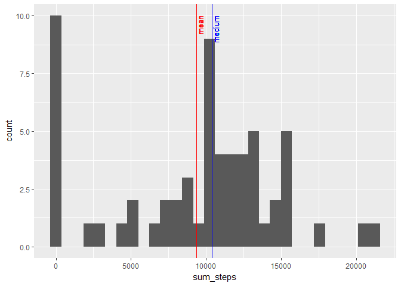
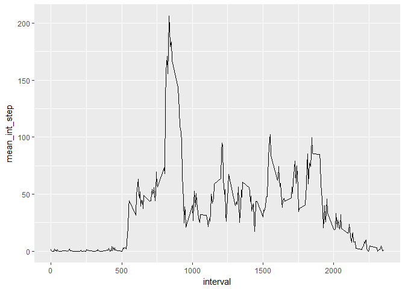
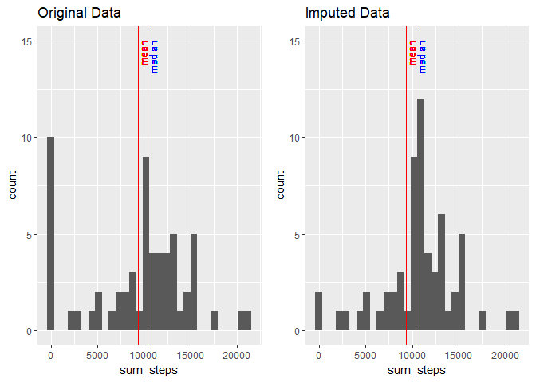
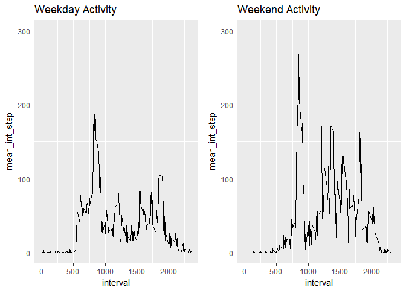

```r
library (dplyr)
```

```
## 
## Attaching package: 'dplyr'
```

```
## The following objects are masked from 'package:stats':
## 
##     filter, lag
```

```
## The following objects are masked from 'package:base':
## 
##     intersect, setdiff, setequal, union
```

```r
library(ggplot2)
```

```
## Warning: package 'ggplot2' was built under R version 3.4.3
```

```r
library(gridExtra)
```

```
## Warning: package 'gridExtra' was built under R version 3.4.3
```

```
## 
## Attaching package: 'gridExtra'
```

```
## The following object is masked from 'package:dplyr':
## 
##     combine
```

```r
library(lubridate)
```

```
## 
## Attaching package: 'lubridate'
```

```
## The following object is masked from 'package:base':
## 
##     date
```


## Loading and preprocessing the data

```r
#list what is in the zip file
unzip("activity.zip", list=TRUE)
```

```
##           Name Length                Date
## 1 activity.csv 350829 2014-02-11 10:08:00
```

```r
#read the activity.csv
input_data <- read.csv(unzip(zipfile="activity.zip"))
```


## What is mean total number of steps taken per day?
1. Calculate the total number of steps taken per day   

2. If you do not understand the difference between a histogram and a barplot, research the difference between them. Make a histogram of the total number of steps taken each day  

3. Calculate and report the mean and median of the total number of steps taken per day


```r
Total_Daily_Steps <- input_data %>%
                     group_by(date) %>%
                     summarize(sum_steps = sum(steps, na.rm=TRUE))

mean_daily = round(mean(Total_Daily_Steps$sum_steps),0)
median_daily = round(median(Total_Daily_Steps$sum_steps),0)

#qplot(data=Total_Daily_Steps, x=sum_steps)

ggplot(Total_Daily_Steps,aes(sum_steps)) + 
    geom_histogram() + 
    geom_vline(xintercept = mean_daily, color="red") + 
    geom_text(aes(x=mean_daily, y=10), label='mean', color="red", size=3.5, angle=90, hjust=1, vjust=1) + 
    geom_vline(xintercept = median_daily, color="blue") + 
    geom_text(aes(x=median_daily, y=10),label='medium', color="blue",size=3.5,angle=90, hjust=1, vjust=1)
```

```
## `stat_bin()` using `bins = 30`. Pick better value with `binwidth`.
```

<!-- -->
  The mean number of steps taken per day is 9354
  The median number of steps taken per day is 1.0395\times 10^{4}


## What is the average daily activity pattern?
1.	Make a time series plot (i.e. type = "l") of the 5-minute interval (x-axis) and the average number of steps taken, averaged across all days (y-axis) 

2.	Which 5-minute interval, on average across all the days in the dataset, contains the maximum number of steps?


```r
Total_Daily_Steps$date <- ymd(Total_Daily_Steps$date)


interval_mean <- input_data %>%
                 group_by(interval)%>%
                 summarize(mean_int_step = mean(steps, na.rm=TRUE))

ggplot(interval_mean, aes(interval, mean_int_step)) + geom_line()
```

<!-- -->

```r
max_step = interval_mean[which.max(interval_mean$mean_int_step),'interval']
```
  At interval 835, on average across all the days in the dataset, contains the maximum number of steps.

## Imputing missing values

1. Calculate and report the total number of missing values in the dataset (i.e. the total number of rows with NAs)

2. Devise a strategy for filling in all of the missing values in the dataset. The strategy does not need to be sophisticated. For example, you could use the mean/median for that day, or the mean for that 5-minute interval, etc.

3. Create a new dataset that is equal to the original dataset but with the missing data filled in.

4.Make a histogram of the total number of steps taken each day and Calculate and report the mean and median total number of steps taken per day. Do these values differ from the estimates from the first part of the assignment? What is the impact of imputing missing data on the estimates of the total daily number of steps?


```r
missing_cnt = sum(is.na(input_data))

input_data2 <- input_data

# fill missing data by the mean of interval 

for (i in seq(nrow(input_data2))) { 
    if (is.na(input_data2[i,"steps"])) { 
        input_data2$steps[i]<-interval_mean$mean_int_step[which(interval_mean$interval==input_data2$interval[i])]
    }
}

Total_Daily_Steps2 <- input_data2 %>% 
                      group_by(date) %>% 
                      summarize(sum_steps = sum(steps, na.rm=TRUE))

mean_daily2 = round(mean(Total_Daily_Steps$sum_steps),0)
median_daily2=round(median(Total_Daily_Steps$sum_steps),0)

#par(mfrow=c(1,2))

p1 <- ggplot(Total_Daily_Steps,aes(sum_steps)) + 
      geom_histogram() + expand_limits(y=c(0,15)) + 
      geom_vline(xintercept = mean_daily, color="red") + 
      geom_text(aes(x=mean_daily, y=15), label='mean', color="red", size=3.5, angle=90, hjust=1, vjust=1) +
      geom_vline(xintercept = median_daily, color="blue") +
      geom_text(aes(x=median_daily, y=15),label='median', color="blue",size=3.5,angle=90, hjust=1, vjust=1) +
      ggtitle('Original Data')

p2 <- ggplot(Total_Daily_Steps2,aes(sum_steps)) + 
      geom_histogram() + expand_limits(y=c(0,15)) + 
      geom_vline(xintercept = mean_daily2, color="red") + 
      geom_text(aes(x=mean_daily2, y=15), label='mean', color="red", size=3.5, angle=90, hjust=1, vjust=1) + 
      geom_vline(xintercept = median_daily2, color="blue") +
      geom_text(aes(x=median_daily2, y=15),label='median', color="blue",size=3.5,angle=90, hjust=1, vjust=1) +
      ggtitle('Imputed Data')

grid.arrange(p1, p2, ncol=2)
```

```
## `stat_bin()` using `bins = 30`. Pick better value with `binwidth`.
## `stat_bin()` using `bins = 30`. Pick better value with `binwidth`.
```

<!-- -->
The missing values have impact to the data.

## Are there differences in activity patterns between weekdays and weekends?


```r
input_data <- input_data %>%
              mutate(day = wday(as.Date(input_data$date, "%Y-%m-%d"))) %>%
              mutate(weekdays = day<6)

# split the data by weekdays and weekends, then do a time series 

# weekday activity #
weekday = input_data %>%
          filter(input_data$weekdays == TRUE)

weekday_interval_mean <- weekday %>%
                 group_by(interval)%>%
                 summarize(mean_int_step = mean(steps, na.rm=TRUE))

# weekend activity #
weekend = input_data %>%
          filter(input_data$weekdays == FALSE)

weekend_interval_mean <- weekend %>%
                 group_by(interval)%>%
                 summarize(mean_int_step = mean(steps, na.rm=TRUE))


p1 <- ggplot(weekday_interval_mean, aes(interval, mean_int_step)) + geom_line() + expand_limits(y=c(0,300)) + ggtitle("Weekday Activity")
p2 <- ggplot(weekend_interval_mean, aes(interval, mean_int_step)) + geom_line() +expand_limits(y=c(0,300)) + ggtitle("Weekend Activity")
grid.arrange(p1, p2, ncol=2) 
```

<!-- -->

